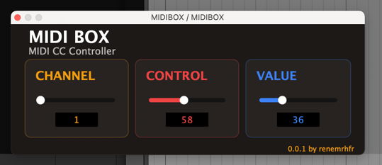

# MIDI Box

MIDI Box is a simple and effective MIDI CC (Control Change) controller plugin built with JUCE.

## Overview

MIDI Box allows you to easily generate MIDI Control Change messages to control parameters like Articulation or Program Change.

## Features

- **MIDI Channel Selection**: Choose any MIDI channel (1-16) to transmit on
- **Control Number Selection**: Select any CC number (0-127)
- **Value Control**: Specify the value (0-127) to send for the selected CC
- **Parameter Automation**: All controls can be automated in your DAW

## How It Works

MIDI Box operates as a MIDI effect plugin. It passes through all incoming MIDI data and adds a single CC message based on your settings. This makes it easy to incorporate into your existing MIDI signal chain.

# Requirements
You need the JUCE Framework to compile this project (https://juce.com).
Make sure to change the path in CMakeLists.txt